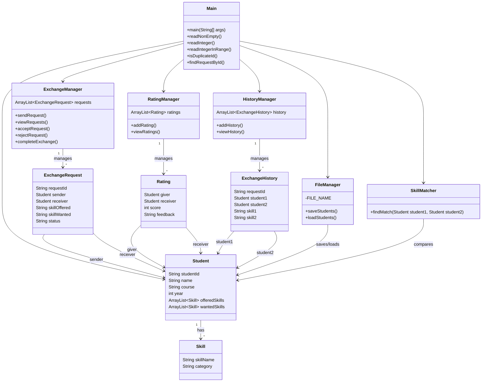

# Class Diagram

## Campus Skill Exchange

```mermaid
classDiagram

class Main {
    +main(String[] args)
    +readNonEmpty()
    +readInteger()
    +readIntegerInRange()
    +isDuplicateId()
    +findRequestById()
}

class Student {
    String studentId
    String name
    String course
    int year
    ArrayList~Skill~ offeredSkills
    ArrayList~Skill~ wantedSkills
}

class Skill {
    String skillName
    String category
}

class SkillMatcher {
    +findMatch(Student student1, Student student2)
}

class ExchangeRequest {
    String requestId
    Student sender
    Student receiver
    String skillOffered
    String skillWanted
    String status
}

class ExchangeManager {
    ArrayList~ExchangeRequest~ requests
    +sendRequest()
    +viewRequests()
    +acceptRequest()
    +rejectRequest()
    +completeExchange()
}

class Rating {
    Student giver
    Student receiver
    int score
    String feedback
}

class RatingManager {
    ArrayList~Rating~ ratings
    +addRating()
    +viewRatings()
}

class ExchangeHistory {
    String requestId
    Student student1
    Student student2
    String skill1
    String skill2
}

class HistoryManager {
    ArrayList~ExchangeHistory~ history
    +addHistory()
    +viewHistory()
}

class FileManager {
    -FILE_NAME
    +saveStudents()
    +loadStudents()
}

Main --> Student
Main --> SkillMatcher
Main --> ExchangeManager
Main --> RatingManager
Main --> HistoryManager
Main --> FileManager

Student "1" --> "*" Skill : has
ExchangeRequest --> Student : sender
ExchangeRequest --> Student : receiver

ExchangeManager "1" --> "*" ExchangeRequest : manages
Rating --> Student : giver
Rating --> Student : receiver
RatingManager "1" --> "*" Rating : manages

ExchangeHistory --> Student : student1
ExchangeHistory --> Student : student2
HistoryManager "1" --> "*" ExchangeHistory : manages

FileManager --> Student : saves/loads
SkillMatcher --> Student : compares
```
