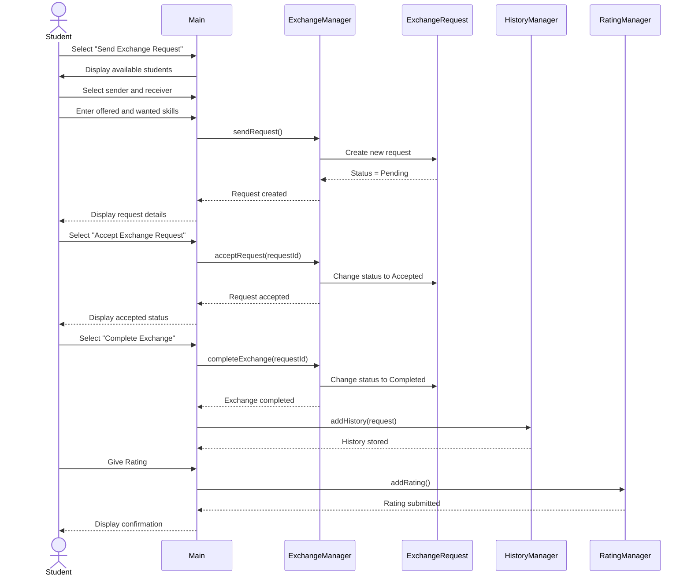

# Sequence Diagram

## Sending and Completing a Skill Exchange Request

```mermaid
sequenceDiagram

    actor Student
    participant Main
    participant ExchangeManager
    participant ExchangeRequest
    participant HistoryManager
    participant RatingManager

    Student->>Main: Select "Send Exchange Request"
    Main->>Student: Display available students
    Student->>Main: Select sender and receiver
    Student->>Main: Enter offered and wanted skills

    Main->>ExchangeManager: sendRequest()
    ExchangeManager->>ExchangeRequest: Create new request
    ExchangeRequest-->>ExchangeManager: Status = Pending
    ExchangeManager-->>Main: Request created
    Main-->>Student: Display request details

    Student->>Main: Select "Accept Exchange Request"
    Main->>ExchangeManager: acceptRequest(requestId)
    ExchangeManager->>ExchangeRequest: Change status to Accepted
    ExchangeManager-->>Main: Request accepted
    Main-->>Student: Display accepted status

    Student->>Main: Select "Complete Exchange"
    Main->>ExchangeManager: completeExchange(requestId)
    ExchangeManager->>ExchangeRequest: Change status to Completed
    ExchangeManager-->>Main: Exchange completed

    Main->>HistoryManager: addHistory(request)
    HistoryManager-->>Main: History stored

    Student->>Main: Give Rating
    Main->>RatingManager: addRating()
    RatingManager-->>Main: Rating submitted
    Main-->>Student: Display confirmation
```
